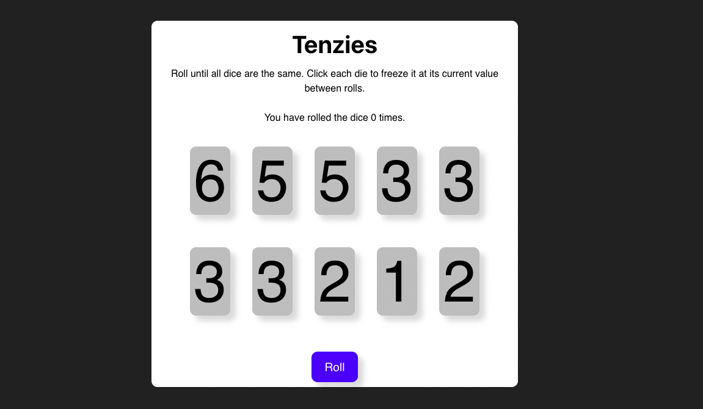

# 🎲 Tenzies Game (React)

🌐 **Live Site:** [https://tenzies-react-nine.vercel.app/](https://tenzies-react-nine.vercel.app/)


A browser-based version of the classic dice game **Tenzies**, built with React. The goal is to roll until all 10 dice show the same number. You can hold dice between rolls to try and match the rest.

This project was created to practice working with React state, conditional rendering, and component structuring.

## 🧠 What I Practiced

- React state management using `useState`.
- Conditionally rendering UI elements.
- Creating reusable components.
- Handling game logic (win conditions, resetting, etc.).

## 🎮 How to Play

1. Click the **Roll** button to roll all dice.
2. Click on a die to **hold its value**.
3. Keep rolling until **all dice show the same number** and are held.
4. Once you win, click **New Game** to restart.


## Installation
```bash
1. Clone the repository:
   git clone https://github.com/wesleyajavon/tenzies-react.git
   cd tenzies-react
   cd tenzies
   npm install
   npm run dev
```

## 🖼️ Screenshot


